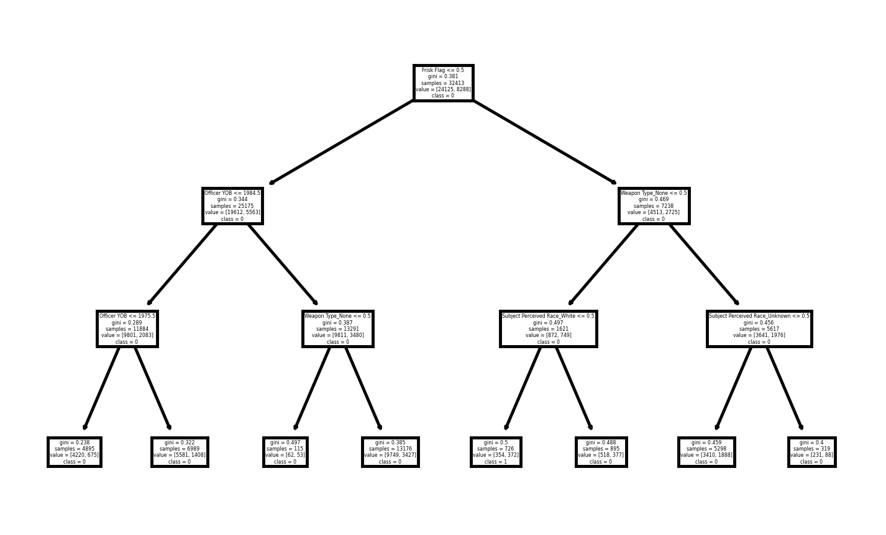
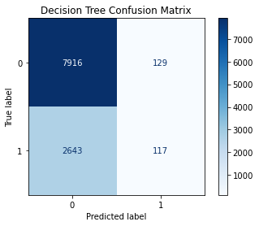
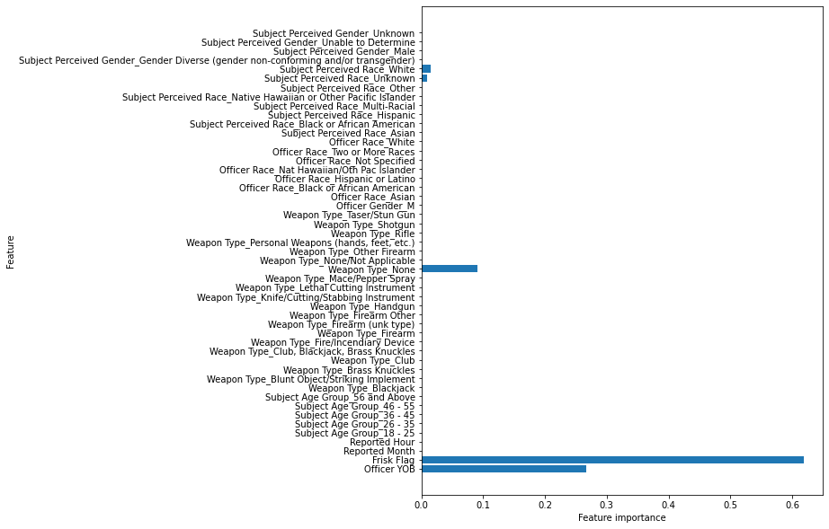

# Predicting Terry Stop Arrests
Author: Carlos Garza

# Overview
This notebook details the building, tuning and deployment of a categorical model that predicts whether an arrest was made during traffic stops by the Seattle Police. Tools utilized include but are not limited to K-Nearest Neighbors models, decision trees, random forests, and XGBoost.

Because the data includes race and gender of both the officers and suspects, this will be a purely objective model based on public data and will not include further social commentary. Social issues regarding race and gender are outside of the scope of this project.

My data, methodology, and derived conclusions are summarized in the body of this document.

# Business Problem
In the late 1960's, the supreme court ruled in Terry vs. Ohio that "stop and frisk" police tactics are not a violation of constitutional rights. Because of this, police can detain a person on the grounds of "reasonable suspicion," even in the absence of clearer evidence.

This ruling lead to the coining of the term Terry Stop, which is when an officer of the law briefly detains a driver based on the reasonable suspician that the driver is involved in criminal activity.

Based on data from Terry Stops from the Seattle Police Department, a classifying model can be built to predict if a Terry Stop will result in an arrest, and from that model the most influencial factors in an arrest can be determined.

## Data
The data utilized in this project comes from [data.seattle.gov](https://data.seattle.gov/Public-Safety/Terry-Stops/28ny-9ts8) and consists of 46.3k Terry Stops, as reported by the conducting officer. A [copy](data/Terry_Stops.csv) of the csv file can be found in the data folder of this repository or at [data.gov](https://catalog.data.gov/dataset/terry-stops).

## Methods
This project makes use of multiple classification models and scikitlearn packages. 
+ The data was cleaned and split into training and testing data sets.
+ the training set was used to train K-Nearest Neighbor, decision tree, and random forest models.
+ The models were evaluated, tuned, and tested to find the best performing model, the decision tree.
+ The tuned decision tree provided the most important variables for predicting if a terry stop would result in an arrest.

## Results
After data cleaning and multiple reitterations of the model, a decision tree was created that accurately predicts 74% of Terry Stop outcomes based on other stop variables.

The final model's confusion matrix is shown in the figure below.

The most important features can be summarized by the chart below. 


## Conclusions
The most important feature to a random stop influencing if a subject is arrested is whether or not the subject was frisked. Following that is the age of the officer and whether or not the subject had any weapons. the type of weapon did not matter.

The decision tree classifier trained with this data had an accuracy rating of about 75%

## Future Work
+ Explore ways to decrease the rate of false positives in our model.
+ Incorporate data from a wider geographic area to create a more comprehensive model.

## For More Information
For more detailed information, please review my full analysis in [my Jupyter Notebook](./master_analysis.ipynb) or my [presentation](./project_presentation.pdf).

For any additional questions, please contact me by email: **carlosjgarza89@gmail.com**

## Repository Structure
```
├── README.md                           <- The top-level README for reviewers of this project
├── master_notebook.ipynb               <- Narrative documentation of analysis in Jupyter notebook
├── master_notebook.pdf                 <- PDF version of master notebook
├── project_presentation.pdf            <- PDF version of project presentation
├── data                                <- Both sourced externally and generated from code
├── images                              <- Both sourced externally and generated from code
└── scratch                             <- Notebooks used for scratchwork and unorganized processing
```
